# APP_MAP.md — Mapa vivo de la aplicación GameboxServtc

> **Última actualización:** 2026-06-19  
> Este archivo es el mapa técnico central del proyecto. Debe actualizarse cada vez que se cree, mueva, renombre o modifique significativamente un archivo, componente, servicio, hook, ruta o módulo.

---

## 1. Estructura principal de carpetas

```text
GameboxServtc/
├── src/
│   ├── App.tsx                    # Raíz de la app, manejo de auth + routing
│   ├── main.tsx                   # Entry point React + QueryClient
│   ├── index.css                  # Estilos globales (31 KB)
│   ├── App.css                    # Estilos de la App shell
│   ├── application/               # Casos de uso y DTOs (Clean Architecture)
│   │   ├── dtos/
│   │   └── use-cases/
│   ├── components/                # Componentes de página (las "páginas" reales)
│   │   ├── ui/                    # Componentes UI reutilizables
│   │   └── auth/                  # Guardas de autenticación
│   ├── config/                    # Configuración de entorno y sedes
│   ├── constants/                 # Constantes globales de la app
│   ├── contexts/                  # Contextos React (Auth, Router)
│   ├── domain/                    # Entidades y contratos de repositorio
│   │   ├── entities/
│   │   └── repositories/
│   ├── hooks/                     # Custom hooks (lógica de negocio + datos)
│   ├── infrastructure/            # Implementación de repositorios + cliente Supabase
│   │   ├── repositories/
│   │   └── supabase/
│   ├── lib/                       # Re-exportación del cliente Supabase + tipos DB
│   ├── presentation/              # Capa presentación (mayormente vacía)
│   ├── services/                  # Servicios externos (QZ Tray, stats técnicos)
│   ├── types/                     # Barrel de tipos re-exportados desde domain
│   └── utils/                     # Utilidades puras
├── docs/                          # Documentación técnica
│   ├── QUALITY_GUARDRAILS.md      # Reglas de linting y calidad de código
│   └── ...
├── supabase/                      # Configuración de Supabase
├── public/                        # Assets públicos
├── dist/                          # Build de producción
├── render.yaml                    # Configuración de despliegue Render
├── vite.config.ts                 # Configuración Vite
├── tailwind.config.js             # Configuración Tailwind
└── package.json                   # Scripts y dependencias
```

---

## 2. Módulos / Features principales

| Módulo | Ruta (página) | Descripción |
|--------|--------------|-------------|
| Dashboard | `dashboard` | Resumen y métricas del negocio |
| Cola de servicios | `orders` | Gestión de órdenes de reparación |
| Clientes | `customers` | Búsqueda y gestión de clientes |
| Crear orden | `create-order` | Formulario de nueva orden de servicio |
| Ventas manuales | `manual-sales` | POS de ventas de productos/consolas |
| Garantías | `warranty` | Búsqueda de garantías por cliente/factura |
| Talleres externos | `external-workshops` | Gestión de tercerizaciones |
| Configuración | `settings` | Ajustes de empresa, impresoras, etc. |
| Usuarios | `users` | Gestión de usuarios y roles |
| Caja | `caja` | Resumen de caja/corte del día |

---

## 3. Componentes principales

| Archivo | Tipo | Responsabilidad |
|---------|------|----------------|
| `App.tsx` | Root | Auth guard + provider + routing entry |
| `components/PageRenderer.tsx` | Router | Switch-case de navegación por estado |
| `components/Layout.tsx` | Shell | Sidebar + header + contenedor principal |
| `components/Login.tsx` | Auth | Formulario de inicio de sesión |
| `components/Dashboard.tsx` | Página | Métricas, órdenes recientes (~48 KB) |
| `components/ServiceQueue.tsx` | Página | Cola de órdenes de servicio (~64 KB) |
| `components/ManualSalesPage.tsx` | Página | POS de ventas manuales (~50 KB) |
| `components/CreateOrder.tsx` | Página | Formulario nueva orden (~50 KB) |
| `components/CustomerSearch.tsx` | Página | Búsqueda y perfil de clientes (~40 KB) |
| `components/WarrantySearch.tsx` | Página | Búsqueda de garantías (~22 KB) |
| `components/Settings.tsx` | Página | Configuración general (~27 KB) |
| `components/ExternalWorkshops.tsx` | Página | Talleres externos (~28 KB) |
| `components/UserManagement.tsx` | Página | Gestión de usuarios (~21 KB) |
| `components/CajaPage.tsx` | Página | Resumen de caja (~17 KB) |
| `components/ComandaPreview.tsx` | Impresión | Vista previa comanda servicio (~36 KB) |
| `components/CommandaPrint.tsx` | Impresión | Render HTML comanda para QZ (~13 KB) |
| `components/MultipleOrdersComandaPreview.tsx` | Impresión | Comandas múltiples (~39 KB) |
| `components/PrinterSettings.tsx` | Config | Configuración de impresoras QZ |
| `components/DeliverySection.tsx` | Modal | Sección de entrega de equipos (~14 KB) |
| `components/EditOrderModal.tsx` | Modal | Edición de orden de servicio (~11 KB) |
| `components/TechniciansManagement.tsx` | Página | Gestión de técnicos (~25 KB) |
| `components/InviteUser.tsx` | Usuarios | Invitación de nuevos usuarios |
| `components/InviteAcceptance.tsx` | Auth | Aceptación de invitaciones |
| `components/auth/ProtectedRoute.tsx` | Auth | Guard de rutas por rol |
| `components/ui/Badge.tsx` | UI | Badge de estado |
| `components/ui/Button.tsx` | UI | Botón reutilizable |
| `components/ui/Card.tsx` | UI | Card contenedor |
| `components/ui/CustomModal.tsx` | UI | Modal genérico |
| `components/ui/Input.tsx` | UI | Input controlado |
| `components/ui/StatCard.tsx` | UI | Tarjeta de estadísticas |

---

## 4. Servicios principales

| Archivo | Responsabilidad |
|---------|----------------|
| `services/qzPrinterService.ts` | Conexión QZ Tray, impresión tickets/stickers/comandas |
| `services/technicianStatsService.ts` | Estadísticas de técnicos |
| `lib/supabase.ts` | Re-exporta cliente Supabase + tipos `Database` |
| `infrastructure/supabase/supabaseClient.ts` | Instancia única del cliente Supabase |

---

## 5. Utilidades / Helpers

| Archivo | Responsabilidad |
|---------|----------------|
| `utils/dateFormatter.ts` | Formateo de fechas para UI y tickets |
| `utils/errorHandler.ts` | Normalización y manejo de errores |
| `utils/imageConverter.ts` | Conversión de imágenes a base64 |
| `utils/logger.ts` | Logger centralizado |
| `utils/orderNumber.ts` | Generación de números de orden únicos |
| `utils/printHelpers.ts` | Helpers de formato para impresión |
| `utils/sanitization.ts` | Sanitización de inputs |
| `utils/validation.ts` | Reglas de validación de formularios |
| `constants/index.ts` | Constantes globales (estados, roles, timeouts, etc.) |

---

## 6. Mapa de rutas / navegación

> La navegación **no usa React Router DOM** para cambio de páginas. Usa un **RouterContext** con estado interno (`currentPage: Page`).

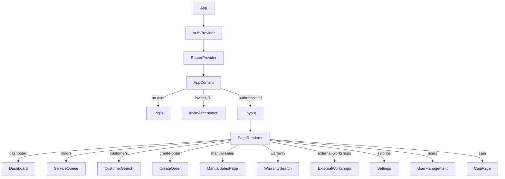

**Páginas disponibles (tipo `Page`):**  
`dashboard | orders | customers | settings | create-order | manual-sales | warranty | external-workshops | users | caja`

---

## 7. Flujo de datos

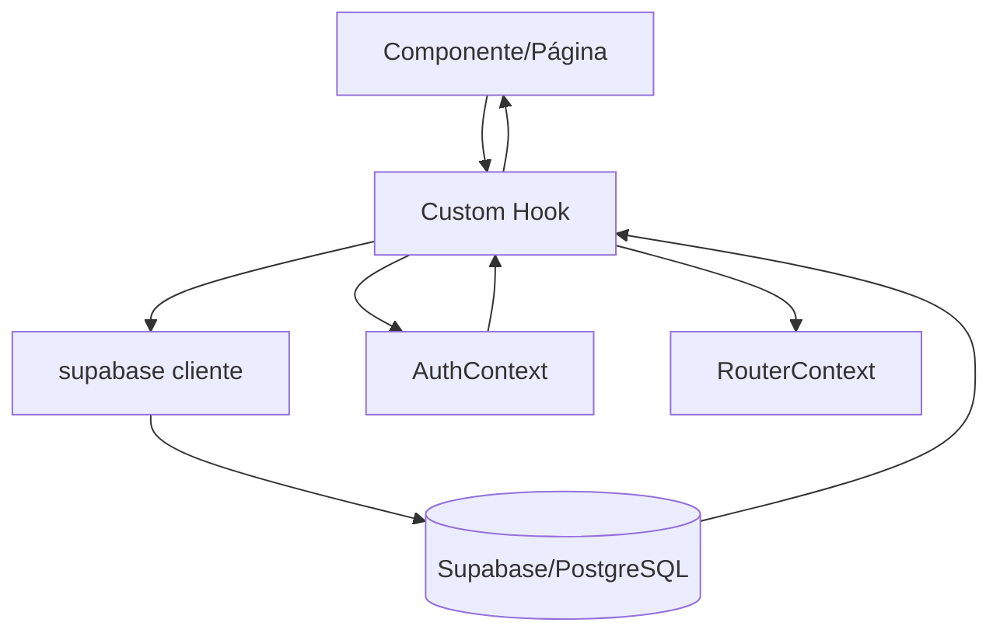

- Los hooks consumen directamente `supabase` desde `lib/supabase.ts`.
- Los repositorios de infraestructura (`infrastructure/repositories/`) son usados por los Use Cases de la capa de aplicación.
- Los hooks del directorio `hooks/` implementan su propio acceso a Supabase (patrón dual).

---

## 8. Flujo de ventas (Venta Manual)

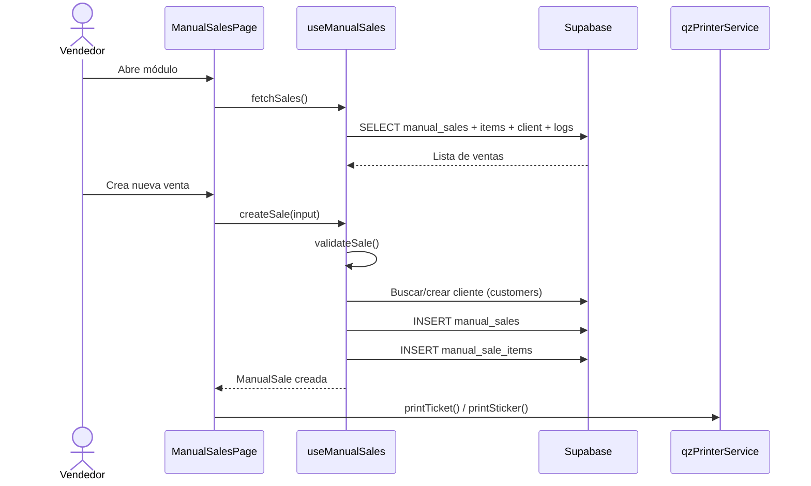

**Tablas involucradas:** `customers`, `manual_sales`, `manual_sale_items`, `manual_sale_whatsapp_logs`

---

## 9. Flujo de ventas manuales (detalle)

- **Validación:** `useManualSales.validateSale()` — nombre, cédula, celular, método de pago, mínimo 1 ítem.
- **Garantía:** Se calcula automáticamente con `warranty_days` desde `warranty_start_date`.
- **Cliente:** `ensureCustomer()` busca por cédula/teléfono; si no existe, crea uno nuevo.
- **Totales:** subtotal, discount_total, total se calculan en el hook antes de insertar.
- **WhatsApp:** `sendWhatsappTicket()` invoca Supabase Edge Function `send-whatsapp-ticket`.
- **Anulación:** Solo `admin` puede cancelar; requiere motivo.

---

## 10. Flujo de impresión de tickets

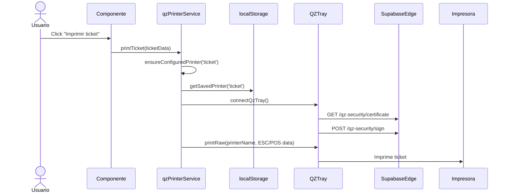

**Clave de localStorage:** `gamebox_ticket_printer`

---

## 11. Flujo de impresión de stickers

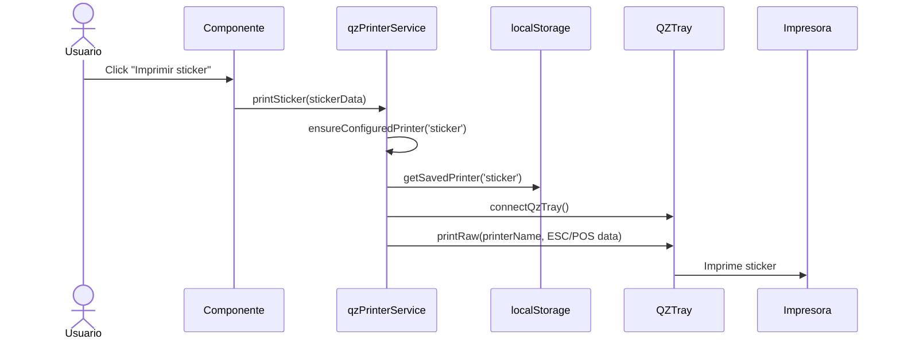

**Clave de localStorage:** `gamebox_sticker_printer`

---

## 12. Flujo de garantías

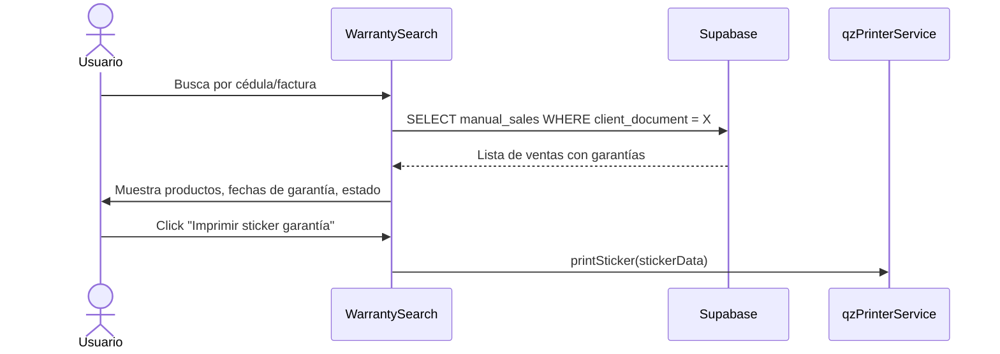

**Campos clave:** `warranty_start_date`, `warranty_end_date`, `warranty_days`, `warranty_type`  
**Cálculo:** `warranty_end_date = warranty_start_date + warranty_days días`

---

## 13. Flujo de clientes

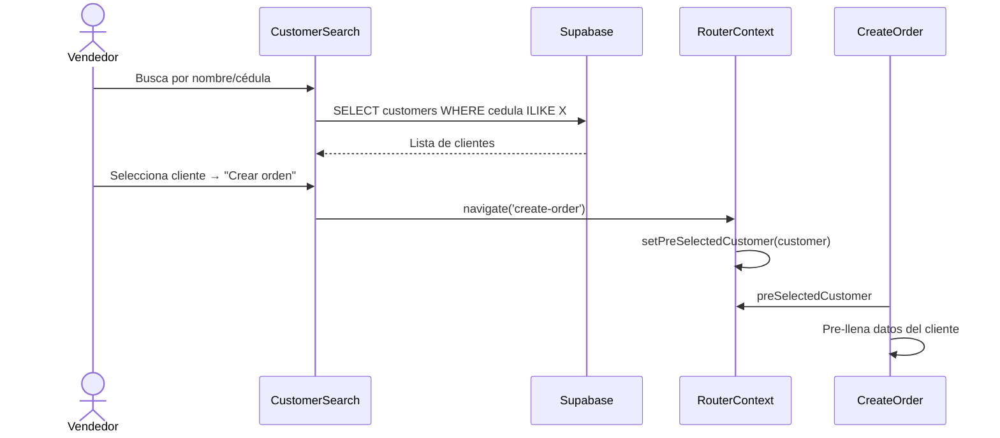

**Tabla:** `customers` (id, cedula, full_name, phone, email)

---

## 14. Flujo de base de datos / Supabase / PostgreSQL

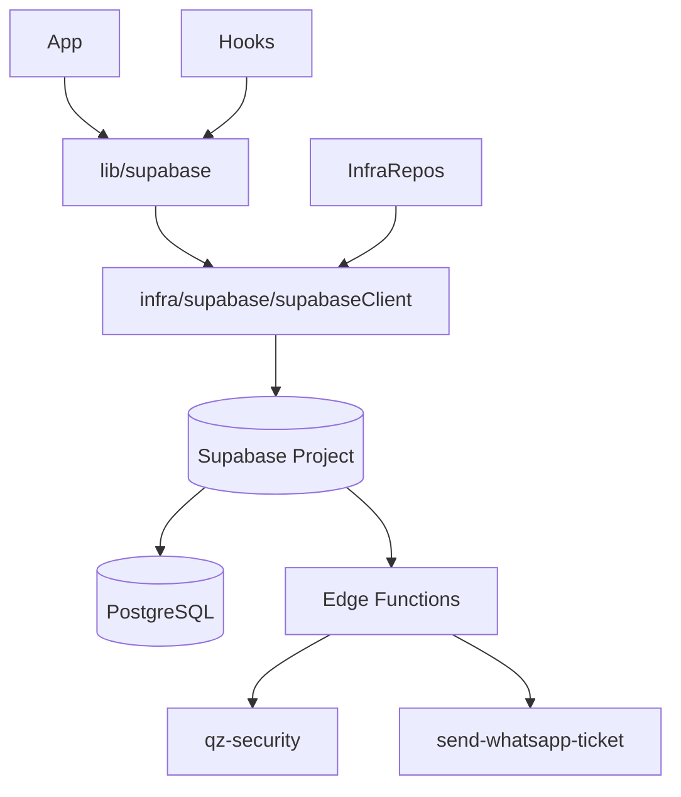

**Tablas conocidas:**
| Tabla | Descripción |
|-------|-------------|
| `profiles` | Usuarios con roles (admin/receptionist/technician) |
| `customers` | Clientes (cedula, nombre, teléfono, email) |
| `service_orders` | Órdenes de servicio técnico |
| `manual_sales` | Ventas manuales de productos |
| `manual_sale_items` | Ítems de ventas manuales |
| `manual_sale_whatsapp_logs` | Logs de WhatsApp |
| `external_workshops` | Talleres de tercerización |
| `external_repairs` | Reparaciones externas |
| `company_settings` | Configuración de empresa |
| `pending_invites` | Invitaciones pendientes |

---

## 15. Flujo de configuración de impresoras

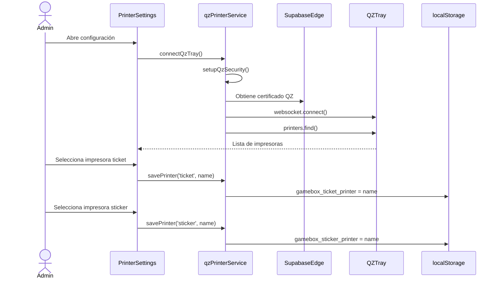

---

## 16. Flujo de entorno / configuración

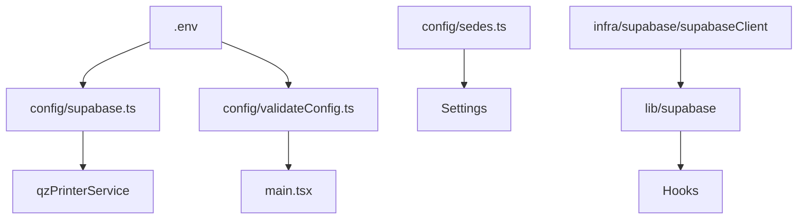

**Variables de entorno requeridas:**
| Variable | Uso |
|----------|-----|
| `VITE_SUPABASE_URL` | URL del proyecto Supabase |
| `VITE_SUPABASE_ANON_KEY` | Clave anónima Supabase |

---

## 17. Grafo de dependencias entre módulos

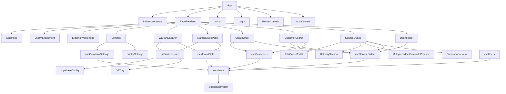

---

## 18. Tabla de archivos clave y responsabilidades

| Módulo | Archivos principales | Responsabilidad | Depende de | Nivel de riesgo |
|--------|---------------------|----------------|-----------|----------------|
| **Auth** | `AuthContext.tsx`, `Login.tsx`, `ProtectedRoute.tsx`, `InviteAcceptance.tsx` | Autenticación, sesión, roles | Supabase Auth | Alto |
| **Routing** | `RouterContext.tsx`, `PageRenderer.tsx` | Navegación interna por estado | AuthContext | Medio |
| **Layout** | `Layout.tsx` | Shell visual, sidebar, header | RouterContext, AuthContext | Medio |
| **Órdenes de servicio** | `ServiceQueue.tsx`, `CreateOrder.tsx`, `useServiceOrders.ts` | CRUD de órdenes, estados, asignación técnicos | Supabase, AuthContext | Crítico |
| **Ventas manuales** | `ManualSalesPage.tsx`, `useManualSales.ts`, `ManualSale.ts` | POS de ventas, garantías, cálculos | Supabase, Auth, QZ | Crítico |
| **Clientes** | `CustomerSearch.tsx`, `useCustomers.ts`, `Customer.ts` | Búsqueda, creación de clientes | Supabase | Alto |
| **Garantías** | `WarrantySearch.tsx` | Búsqueda y visualización de garantías | useManualSales, QZ | Alto |
| **Impresión** | `qzPrinterService.ts`, `ComandaPreview.tsx`, `CommandaPrint.tsx`, `PrinterSettings.tsx` | QZ Tray, tickets ESC/POS, stickers, comandas | QZ Tray, Supabase Edge | Alto |
| **Talleres externos** | `ExternalWorkshops.tsx`, `useExternalWorkshops.ts`, `useExternalRepairs.ts` | Tercerizaciones | Supabase | Medio |
| **Dashboard** | `Dashboard.tsx` | Métricas y KPIs | useServiceOrders, Supabase | Medio |
| **Caja** | `CajaPage.tsx` | Resumen financiero del día | Supabase | Medio |
| **Usuarios** | `UserManagement.tsx`, `useUsers.ts`, `InviteUser.tsx` | Gestión de usuarios, roles | Supabase Auth | Alto |
| **Configuración** | `Settings.tsx`, `useCompanySettings.ts`, `PrinterSettings.tsx` | Empresa, sedes, impresoras | Supabase, QZ | Medio |
| **Supabase Client** | `lib/supabase.ts`, `infrastructure/supabase/supabaseClient.ts`, `config/supabase.ts` | Cliente DB único, tipos DB | Variables de entorno | Crítico |
| **Dominio** | `domain/entities/`, `domain/repositories/` | Contratos y entidades de negocio | — | Bajo |
| **Use Cases** | `application/use-cases/`, `application/dtos/` | Lógica de negocio de servicio técnico | Domain, Infra repos | Medio |
| **Constantes** | `constants/index.ts` | Magic values centralizados | — | Bajo |
| **Utils** | `utils/*.ts` | Funciones puras de apoyo | — | Bajo |
| **Documentación** | `docs/QUALITY_GUARDRAILS.md`, `APP_MAP.md`, etc. | Reglas de arquitectura, calidad y mapas del proyecto | — | Bajo |

---

*Este archivo debe mantenerse actualizado. Ver reglas en el SKILL.md del proyecto.*
